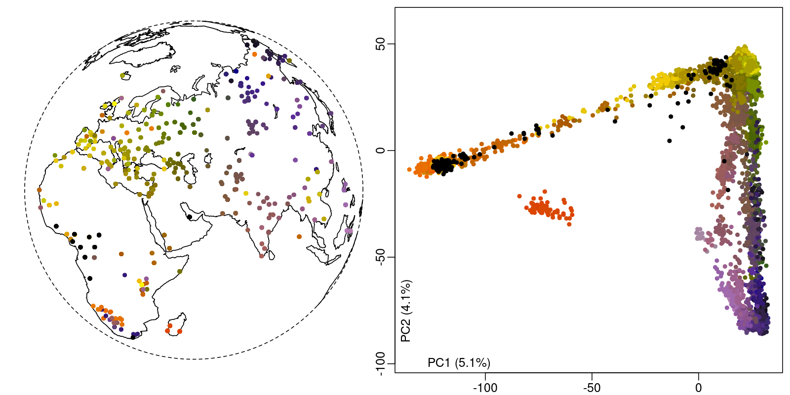

Poseidon package for the c1global1nfd_public dataset originally compiled for [Peter, Petkova \& Novembre 2020](https://doi.org/10.1093/molbev/msz280), and then published with [Shastry, Musiani \& Novembre 2025](https://doi.org/10.1101/2025.02.10.637386).

With 19,954 SNPs for 4,070 modern human individuals and 336 populations from Afro-Eurasia this dataset is a great resource for (superficial) large scale analysis of population structure. It will certainly also work well as a training dataset.

Shastry, Musiani \& Novembre 2025 have shared this dataset under a [Creative Commons Attribution 4.0 International](https://creativecommons.org/licenses/by/4.0/legalcode) license on zenodo here: <https://doi.org/10.5281/zenodo.15007584>. I share it here in the form of a [Poseidon package](https://www.poseidon-adna.org) with tidy context data and a bibliography in bibtex format.

**Please note that you must cite Peter, Petkova \& Novembre 2020, Shastry, Musiani \& Novembre 2025 and the individual data-providing papers if you want to use this dataset for any purpose.**

***

Here's a list of the  data-providing papers (see [here](c1global1nfd_public/c1global1nfd_public.bib) for the bibtex file):

> Behar, D., Yunusbayev, B., Metspalu, M., Metspalu, E., Rosset, S., Parik, J., Rootsi, S., Chaubey, G., Kutuev, I., Yudkovsky, G., Khusnutdinova, E., Balanovsky, O., Semino, O., Pereira, L., Comas, D., Gurwitz, D., Bonne-Tamir, B., Parfitt, T., Hammer, M., Skorecki, K., & Villems, R. (2010). The genome-wide structure of the Jewish people. Nature, 466(7303), 238–242.

> Behar, D., Metspalu, M., Baran, Y., Kopelman, N., Yunusbayev, B., Gladstein, A., Tzur, S., Sahakyan, H., Bahmanimehr, A., Yepiskoposyan, L., Tambets, K., Khusnutdinova, E., Kushniarevich, A., Balanovsky, O., Balanovsky, E., Kovacevic, L., Marjanovic, D., Mihailov, E., Kouvatsi, A., Triantaphyllidis, C., King, R., Semino, O., Torroni, A., Hammer, M., Metspalu, E., Skorecki, K., Rosset, S., Halperin, E., Villems, R., & Rosenberg, N. (2013). No Evidence from Genome-Wide Data of a Khazar Origin for the Ashkenazi Jews. Human Biology, 85(6), 859–900.

> Bryc, K., Auton, A., Nelson, M., Oksenberg, J., Hauser, S., Williams, S., Froment, A., Bodo, J.M., Wambebe, C., Tishkoff, S., & Bustamante, C. (2009). Genome-wide patterns of population structure and admixture in West Africans and African Americans. Proceedings of the National Academy of Sciences, 107(2), 786–791.

> Cardona, A., Pagani, L., Antao, T., Lawson, D., Eichstaedt, C., Yngvadottir, B., Shwe, M., Wee, J., Romero, I., Raj, S., Metspalu, M., Villems, R., Willerslev, E., Tyler-Smith, C., Malyarchuk, B., Derenko, M., & Kivisild, T. (2014). Genome-Wide Analysis of Cold Adaptation in Indigenous Siberian Populations. PLoS ONE, 9(5), e98076.

> Chaubey, G., Metspalu, M., Choi, Y., Magi, R., Romero, I., Soares, P., Oven, M., Behar, D., Rootsi, S., Hudjashov, G., Mallick, C., Karmin, M., Nelis, M., Parik, J., Reddy, A., Metspalu, E., Driem, G., Xue, Y., Tyler-Smith, C., Thangaraj, K., Singh, L., Remm, M., Richards, M., Lahr, M., Kayser, M., Villems, R., & Kivisild, T. (2010). Population Genetic Structure in Indian Austroasiatic Speakers: The Role of Landscape Barriers and Sex-Specific Admixture. Molecular Biology and Evolution, 28(2), 1013–1024.

> Di Cristofaro, J., Pennarun, E., Mazières, S., Myres, N., Lin, A., Temori, S., Metspalu, M., Metspalu, E., Witzel, M., King, R., Underhill, P., Villems, R., & Chiaroni, J. (2013). Afghan Hindu Kush: Where Eurasian Sub-Continent Gene Flows Converge. PLoS ONE, 8(10), e76748.

> Fedorova, S., Reidla, M., Metspalu, E., Metspalu, M., Rootsi, S., Tambets, K., Trofimova, N., Zhadanov, S., Kashani, B., Olivieri, A., Voevoda, M., Osipova, L., Platonov, F., Tomsky, M., Khusnutdinova, E., Torroni, A., & Villems, R. (2013). Autosomal and uniparental portraits of the native populations of Sakha (Yakutia): implications for the peopling of Northeast Eurasia. BMC Evolutionary Biology, 13(1).

> Hunter-Zinck, H., Musharoff, S., Salit, J., Al-Ali, K., Chouchane, L., Gohar, A., Matthews, R., Butler, M., Fuller, J., Hackett, N., Crystal, R., & Clark, A. (2010). Population Genetic Structure of the People of Qatar. The American Journal of Human Genetics, 87(1), 17–25.

> Kovacevic, L., Tambets, K., Ilumäe, A.M., Kushniarevich, A., Yunusbayev, B., Solnik, A., Bego, T., Primorac, D., Skaro, V., Leskovac, A., Jakovski, Z., Drobnic, K., Tolk, H.V., Kovacevic, S., Rudan, P., Metspalu, E., & Marjanovic, D. (2014). Standing at the Gateway to Europe - The Genetic Structure of Western Balkan Populations Based on Autosomal and Haploid Markers. PLoS ONE, 9(8), e105090.

> Lazaridis, I., Patterson, N., Mittnik, A., Renaud, G., Mallick, S., Kirsanow, K., Sudmant, P., Schraiber, J., Castellano, S., Lipson, M., Berger, B., Economou, C., Bollongino, R., Fu, Q., Bos, K., Nordenfelt, S., Li, H., Filippo, C., Prufer, K., Sawyer, S., Posth, C., Haak, W., Hallgren, F., Fornander, E., Rohland, N., Delsate, D., Francken, M., Guinet, J.M., Wahl, J., Ayodo, G., Babiker, H., Bailliet, G., Balanovska, E., Balanovsky, O., Barrantes, R., Bedoya, G., Ben-Ami, H., Bene, J., Berrada, F., Bravi, C., Brisighelli, F., Busby, G., Cali, F., Churnosov, M., Cole, D., Corach, D., Damba, L., Driem, G., Dryomov, S., Dugoujon, J.M., Fedorova, S., Gallego Romero, I., Gubina, M., Hammer, M., Henn, B., Hervig, T., Hodoglugil, U., Jha, A., Karachanak-Yankova, S., Khusainova, R., Khusnutdinova, E., Kittles, R., Kivisild, T., Klitz, W., Kučinskas, V., Kushniarevich, A., Laredj, L., Litvinov, S., Loukidis, T., Mahley, R., Melegh, B., Metspalu, E., Molina, J., Mountain, J., Näkkäläjärvi, K., Nesheva, D., Nyambo, T., Osipova, L., Parik, J., Platonov, F., Posukh, O., Romano, V., Rothhammer, F., Rudan, I., Ruizbakiev, R., Sahakyan, H., Sajantila, A., Salas, A., Starikovskaya, E., Tarekegn, A., Toncheva, D., Turdikulova, S., Uktveryte, I., Utevska, O., Vasquez, R., Villena, M., Voevoda, M., Winkler, C., Yepiskoposyan, L., Zalloua, P., Zemunik, T., Cooper, A., Capelli, C., Thomas, M., Ruiz-Linares, A., Tishkoff, S., Singh, L., Thangaraj, K., Villems, R., Comas, D., Sukernik, R., Metspalu, M., Meyer, M., Eichler, E., Burger, J., Slatkin, M., Pääbo, S., Kelso, J., Reich, D., & Krause, J. (2014). Ancient human genomes suggest three ancestral populations for present-day Europeans. Nature, 513(7518), 409–413.

> Metspalu, M., Romero, I., Yunusbayev, B., Chaubey, G., Mallick, C., Hudjashov, G., Nelis, M., Mägi, R., Metspalu, E., Remm, M., Pitchappan, R., Singh, L., Thangaraj, K., Villems, R., & Kivisild, T. (2011). Shared and Unique Components of Human Population Structure and Genome-Wide Signals of Positive Selection in South Asia. The American Journal of Human Genetics, 89(6), 731–744.

> Migliano, A., Romero, I., Metspalu, M., Leavesley, M., Pagani, L., Antao, T., Huang, D.W., Sherman, B., Siddle, K., Scholes, C., Hudjashov, G., Kaitokai, E., Babalu, A., Belatti, M., Cagan, A., Hopkinshaw, B., Shaw, C., Nelis, M., Metspalu, E., Mägi, R., Lempicki, R., Villems, R., Lahr, M., & Kivisild, T. (2013). Evolution of the Pygmy Phenotype: Evidence of Positive Selection from Genome-wide Scans in African, Asian, and Melanesian Pygmies. Human Biology, 85(1–3), 251–284.

> Paschou, P., Drineas, P., Yannaki, E., Razou, A., Kanaki, K., Tsetsos, F., Padmanabhuni, S., Michalodimitrakis, M., Renda, M., Pavlovic, S., Anagnostopoulos, A., Stamatoyannopoulos, J., Kidd, K., & Stamatoyannopoulos, G. (2014). Maritime route of colonization of Europe. Proceedings of the National Academy of Sciences, 111(25), 9211–9216.

> Pierron, D., Razafindrazaka, H., Pagani, L., Ricaut, F.X., Antao, T., Capredon, M., Sambo, C., Radimilahy, C., Rakotoarisoa, J.A., Blench, R., Letellier, T., & Kivisild, T. (2014). Genome-wide evidence of Austronesian–Bantu admixture and cultural reversion in a hunter-gatherer group of Madagascar. Proceedings of the National Academy of Sciences, 111(3), 936–941.

> Raghavan, M., Skoglund, P., Graf, K., Metspalu, M., Albrechtsen, A., Moltke, I., Rasmussen, S., Stafford Jr, T., Orlando, L., Metspalu, E., Karmin, M., Tambets, K., Rootsi, S., Mägi, R., Campos, P., Balanovska, E., Balanovsky, O., Khusnutdinova, E., Litvinov, S., Osipova, L., Fedorova, S., Voevoda, M., DeGiorgio, M., Sicheritz-Ponten, T., Brunak, S., Demeshchenko, S., Kivisild, T., Villems, R., Nielsen, R., Jakobsson, M., & Willerslev, E. (2013). Upper Palaeolithic Siberian genome reveals dual ancestry of Native Americans. Nature, 505(7481), 87–91.

> Rasmussen, M., Li, Y., Lindgreen, S., Pedersen, J., Albrechtsen, A., Moltke, I., Metspalu, M., Metspalu, E., Kivisild, T., Gupta, R., Bertalan, M., Nielsen, K., Gilbert, M., Wang, Y., Raghavan, M., Campos, P., Kamp, H., Wilson, A., Gledhill, A., Tridico, S., Bunce, M., Lorenzen, E., Binladen, J., Guo, X., Zhao, J., Zhang, X., Zhang, H., Li, Z., Chen, M., Orlando, L., Kristiansen, K., Bak, M., Tommerup, N., Bendixen, C., Pierre, T., Grønnow, B., Meldgaard, M., Andreasen, C., Fedorova, S., Osipova, L., Higham, T., Ramsey, C., Hansen, T., Nielsen, F., Crawford, M., Brunak, S., Sicheritz-Pontén, T., Villems, R., Nielsen, R., Krogh, A., Wang, J., & Willerslev, E. (2010). Ancient human genome sequence of an extinct Palaeo-Eskimo. Nature, 463(7282), 757–762.

> Rasmussen, M., Guo, X., Wang, Y., Lohmueller, K., Rasmussen, S., Albrechtsen, A., Skotte, L., Lindgreen, S., Metspalu, M., Jombart, T., Kivisild, T., Zhai, W., Eriksson, A., Manica, A., Orlando, L., De La Vega, F., Tridico, S., Metspalu, E., Nielsen, K., Ávila-Arcos, M., Moreno-Mayar, J., Muller, C., Dortch, J., Gilbert, M., Lund, O., Wesolowska, A., Karmin, M., Weinert, L., Wang, B., Li, J., Tai, S., Xiao, F., Hanihara, T., Driem, G., Jha, A., Ricaut, F.X., Knijff, P., Migliano, A., Gallego Romero, I., Kristiansen, K., Lambert, D., Brunak, S., Forster, P., Brinkmann, B., Nehlich, O., Bunce, M., Richards, M., Gupta, R., Bustamante, C., Krogh, A., Foley, R., Lahr, M., Balloux, F., Sicheritz-Pontén, T., Villems, R., Nielsen, R., Wang, J., & Willerslev, E. (2011). An Aboriginal Australian Genome Reveals Separate Human Dispersals into Asia. Science, 334(6052), 94–98.

> Skoglund, P., Malmström, H., Omrak, A., Raghavan, M., Valdiosera, C., Günther, T., Hall, P., Tambets, K., Parik, J., Sjögren, K.G., Apel, J., Willerslev, E., Storå, J., Götherström, A., & Jakobsson, M. (2014). Genomic Diversity and Admixture Differs for Stone-Age Scandinavian Foragers and Farmers. Science, 344(6185), 747–750.

> Xing, J., Watkins, W., Shlien, A., Walker, E., Huff, C., Witherspoon, D., Zhang, Y., Simonson, T., Weiss, R., Schiffman, J., Malkin, D., Woodward, S., & Jorde, L. (2010). Toward a more uniform sampling of human genetic diversity: A survey of worldwide populations by high-density genotyping. Genomics, 96(4), 199–210.

> Yunusbayev, B., Metspalu, M., Jarve, M., Kutuev, I., Rootsi, S., Metspalu, E., Behar, D., Varendi, K., Sahakyan, H., Khusainova, R., Yepiskoposyan, L., Khusnutdinova, E., Underhill, P., Kivisild, T., & Villems, R. (2011). The Caucasus as an Asymmetric Semipermeable Barrier to Ancient Human Migrations. Molecular Biology and Evolution, 29(1), 359–365.

> Yunusbayev, B., Metspalu, M., Metspalu, E., Valeev, A., Litvinov, S., Valiev, R., Akhmetova, V., Balanovska, E., Balanovsky, O., Turdikulova, S., Dalimova, D., Nymadawa, P., Bahmanimehr, A., Sahakyan, H., Tambets, K., Fedorova, S., Barashkov, N., Khidiyatova, I., Mihailov, E., Khusainova, R., Damba, L., Derenko, M., Malyarchuk, B., Osipova, L., Voevoda, M., Yepiskoposyan, L., Kivisild, T., Khusnutdinova, E., & Villems, R. (2015). The Genetic Legacy of the Expansion of Turkic-Speaking Nomads across Eurasia. PLOS Genetics, 11(4), e1005068.
